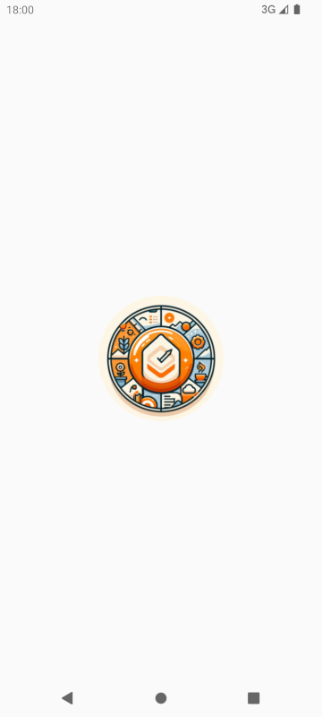
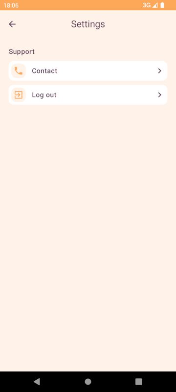
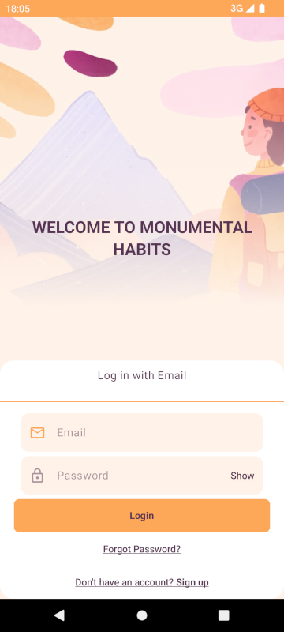
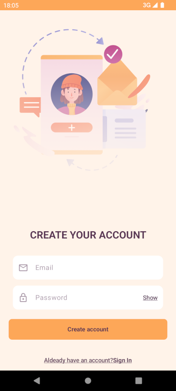
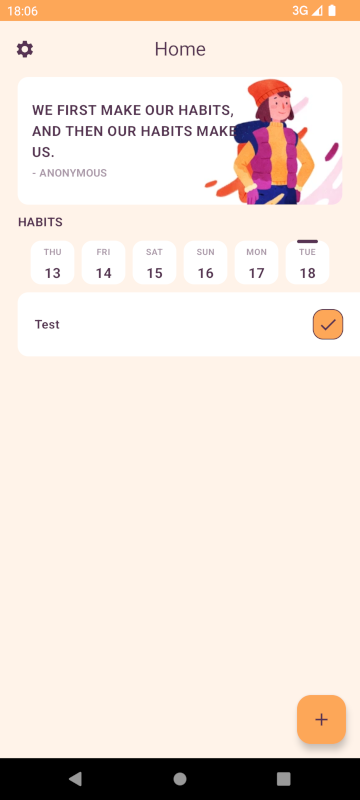

# Habits Tracker PRO App
Esta es una aplicación para poder realizar el de seguimiento de hábitos escrita en Kotlin para Smartphones Android.
HabitsPro soporta varios usuarios, cada uno con sus registros independientes siguiendo el enfoque "Offline-First" permitiendo a los mismos realizar un seguimiento de sus hábitos diarios y recibir recordatorios para ayudarles a mantenerse en el buen camino.
Esta app está diseñada siguiendo los principios SOLID y de Clean Architecture, así como el popular patrón de presentación MVVM, utilizando las últimas tecnologías y bibliotecas hasta la fecha como Kotlin 2.0

Loaging             |  settings
:-------------------------:|:-------------------------:
 | 
Login             |  SignUp
:-------------------------:|:-------------------------:
 | 
Home             |  Detail
:-------------------------:|:-------------------------:
 | 

## Características principales

- Kotlin 2.0: Se utiliza Kotlin 2.0 para aprovechar sus características modernas y mejoras en el rendimiento, lo que facilita el desarrollo de una aplicación robusta y eficiente.
- Modularización: La aplicación está dividida en múltiples módulos, lo que permite una mejor organización del código, facilita el mantenimiento y mejora la capacidad de escalar y probar la aplicación de manera independiente.
- Clean Architecture: El proyecto está estructurado siguiendo el patrón de Clean Architecture, lo que facilita la separación de responsabilidades y mejora la mantenibilidad del código.
- SOLID: Los principios SOLID (Single Responsibility, Open-Closed, Liskov Substitution, Interface Segregation, Dependency Inversion) se aplican en el diseño de la aplicación para promover un código limpio, modular y extensible.
- MVVM: Se implementa el patrón MVVM (Model-View-ViewModel) para separar la lógica de presentación de la lógica de negocio y los datos, lo que mejora la testabilidad y la organización del código.
- Inyección de Dependencias - Dagger-Hilt: Se utiliza Dagger-Hilt para realizar la inyección de dependencias, lo que simplifica la gestión de las dependencias y permite una mejor escalabilidad y prueba unitaria del código.
- Jetpack Compose: La interfaz de usuario se desarrolla utilizando Jetpack Compose, el moderno toolkit de UI de Android que facilita la creación de interfaces de usuario flexibles y dinámicas.
- Firebase Authentication: Se integra Firebase Authentication para proporcionar un sistema de autenticación seguro y confiable para los usuarios de la aplicación.
- Room: Se utiliza Room, la biblioteca de persistencia de Android, para almacenar los datos de los hábitos en una base de datos local y permitir un acceso rápido y eficiente a ellos.
- Retrofit: Se utiliza Retrofit para realizar las llamadas a una API remota y obtener datos relacionados con los hábitos, lo que permite una sincronización eficiente y actualizada de la información.
- Notificaciones: La aplicación permite configurar recordatorios personalizados para cada hábito y muestra notificaciones en los días y horas especificados para ayudar a los usuarios a seguir sus rutinas diarias.
- AlarmManager: El componente AlarmManager de Android se utiliza para programar las notificaciones y garantizar que se muestren en los momentos adecuados.
- WorkManager: Se utiliza WorkManager para gestionar las tareas en segundo plano, lo que permite que los hábitos creados en modo avión se guarden automáticamente en la nube una vez que el dispositivo tenga conexión a Internet.
- Unit Test: Se incluyen pruebas unitarias para verificar el correcto funcionamiento de los componentes clave de la aplicación y garantizar la calidad del código.
- UI Test: Se proporcionan pruebas de interfaz de usuario para verificar que la aplicación se comporte correctamente y proporcione una experiencia de usuario fluida.
- Offline-First: La aplicación está diseñada siguiendo el enfoque "Offline-First", lo que significa que la funcionalidad principal está disponible incluso cuando el dispositivo está sin conexión a Internet. Los datos se sincronizan automáticamente una vez que la conexión está disponible utilizando WorkManager y la API remota.
- Broadcast Receivers: Se utilizan Broadcast Receivers para gestionar el agregado de alarmas cuando el usuario reinicia el dispositivo, y cuando suena una alarma, para configurar la siguiente.

## Uso

- Clona este repositorio o realiza un fork desde GitHub.
- Importa el proyecto desde Android Studio.
- Configura Firebase Authentication en la consola de Firebase y agrega las credenciales necesarias en el proyecto.
- Configura tu API.
- Ejecuta la aplicación.
- Personalizala a tu gusto.
